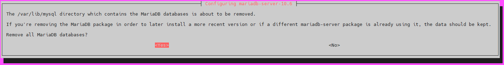

---
layout:
  width: default
  title:
    visible: true
  description:
    visible: false
  tableOfContents:
    visible: true
  outline:
    visible: true
  pagination:
    visible: true
  metadata:
    visible: true
  tags:
    visible: true
---

# MariaDB

[MariaDB Server](https://mariadb.org/) is one of the most popular open source relational databases. It’s made by the original developers of MySQL and guaranteed to stay open source. It is part of most cloud offerings and the default in most Linux distributions.


Difficulty: Easy


<figure><figcaption></figcaption></figure>

## Installation

### Install MariaDB using the apt package manager

* With user `admin`, update and upgrade your OS. Press "**y**" and `enter` or directly `enter` when the prompt asks you

```bash
sudo apt update && sudo apt full-upgrade
```

* Import the repository signing key


```bash
sudo curl -o /etc/apt/keyrings/mariadb-keyring.pgp 'https://mariadb.org/mariadb_release_signing_key.pgp'
```


**Example** of expected output:

```
  % Total    % Received % Xferd  Average Speed   Time    Time     Time  Current
                                 Dload  Upload   Total   Spent    Left  Speed
100  6575  100  6575    0     0  17126      0 --:--:-- --:--:-- --:--:-- 17122
```

* Create the repository configuration file


```bash
sudo tee /etc/apt/sources.list.d/mariadb.sources > /dev/null <<'EOF'
# MariaDB 10.11 repository list - created 2026-04-27 15:45 UTC
# https://mariadb.org/download/
X-Repolib-Name: MariaDB
Types: deb
# deb.mariadb.org is a dynamic mirror if your preferred mirror goes offline. See https://mariadb.org/mirrorbits/ for details.
# URIs: https://deb.mariadb.org/10.11/debian
URIs: https://mirror.raiolanetworks.com/mariadb/repo/10.11/debian
Suites: bookworm
Components: main
Signed-By: /etc/apt/keyrings/mariadb-keyring.pgp
EOF
```


* Update the package lists and install the latest version of MariaDB. Press "**y**" and `enter` or directly `enter` when the prompt asks you

```bash
sudo apt update && sudo apt install mariadb-server
```

* Check the correct installation of MariaDB

```bash
mariadb --version
```

**Example** of expected output:

```
mariadb  Ver 15.1 Distrib 10.6.25-MariaDB, for debian-linux-gnu (x86_64) using  EditLine wrapper
```

#### Validation

* Ensure MariaDB is running and listening on the default port 3306

```bash
sudo ss -tulpn | grep mariadb
```

Expected output:

```
tcp   LISTEN 0      80         127.0.0.1:3306       0.0.0.0:*    users:(("mariadbd",pid=2508568,fd=60))
```

* You can monitor general logs with the systemd journal. You can exit monitoring at any time with `Ctrl-C`

```bash
journalctl -fu mariadb
```

<details>

<summary><strong>Example</strong> of expected output ⬇️</summary>

```
Feb 07 18:39:12 minibolt systemd[1]: Starting MariaDB 12.2.1 database server...
Feb 07 18:39:12 minibolt mariadbd[49627]: 2026-02-07 18:39:12 0 [Note] Starting MariaDB 12.2.1-MariaDB-ubu2204 source revision 144dead8826f4a84008a76ef7fcc44e816f92930 server_uid vV3U6U95+6HHXhr+rO6OO8nlwFE= as process 49627
Feb 07 18:39:12 minibolt mariadbd[49627]: 2026-02-07 18:39:12 0 [Note] InnoDB: Compressed tables use zlib 1.2.11
Feb 07 18:39:12 minibolt mariadbd[49627]: 2026-02-07 18:39:12 0 [Note] InnoDB: Number of transaction pools: 1
Feb 07 18:39:12 minibolt mariadbd[49627]: 2026-02-07 18:39:12 0 [Note] InnoDB: Using crc32 + pclmulqdq instructions
Feb 07 18:39:12 minibolt mariadbd[49627]: 2026-02-07 18:39:12 0 [Note] InnoDB: Using io_uring
Feb 07 18:39:12 minibolt mariadbd[49627]: 2026-02-07 18:39:12 0 [Note] InnoDB: innodb_buffer_pool_size_max=128m, innodb_buffer_pool_size=128m
Feb 07 18:39:12 minibolt mariadbd[49627]: 2026-02-07 18:39:12 0 [Note] InnoDB: Completed initialization of buffer pool
Feb 07 18:39:12 minibolt mariadbd[49627]: 2026-02-07 18:39:12 0 [Note] InnoDB: File system buffers for log disabled (block size=512 bytes)
Feb 07 18:39:12 minibolt mariadbd[49627]: 2026-02-07 18:39:12 0 [Note] InnoDB: End of log at LSN=45759
Feb 07 18:39:12 minibolt mariadbd[49627]: 2026-02-07 18:39:12 0 [Note] InnoDB: Opened 3 undo tablespaces
Feb 07 18:39:12 minibolt mariadbd[49627]: 2026-02-07 18:39:12 0 [Note] InnoDB: 128 rollback segments in 3 undo tablespaces are active.
Feb 07 18:39:12 minibolt mariadbd[49627]: 2026-02-07 18:39:12 0 [Note] InnoDB: Setting file './ibtmp1' size to 12.000MiB. Physically writing the file full; Please wait ...
Feb 07 18:39:12 minibolt mariadbd[49627]: 2026-02-07 18:39:12 0 [Note] InnoDB: File './ibtmp1' size is now 12.000MiB.
Feb 07 18:39:12 minibolt mariadbd[49627]: 2026-02-07 18:39:12 0 [Note] InnoDB: log sequence number 45759; transaction id 14
Feb 07 18:39:12 minibolt mariadbd[49627]: 2026-02-07 18:39:12 0 [Note] InnoDB: Loading buffer pool(s) from /var/lib/mysql/ib_buffer_pool
Feb 07 18:39:12 minibolt mariadbd[49627]: 2026-02-07 18:39:12 0 [Note] Plugin 'FEEDBACK' is disabled.
Feb 07 18:39:12 minibolt mariadbd[49627]: 2026-02-07 18:39:12 0 [Note] Plugin 'wsrep-provider' is disabled.
Feb 07 18:39:12 minibolt mariadbd[49627]: 2026-02-07 18:39:12 0 [Note] InnoDB: Buffer pool(s) load completed at 260207 18:39:12
Feb 07 18:39:13 minibolt mariadbd[49627]: 2026-02-07 18:39:13 0 [Note] Server socket created on IP: '127.0.0.1', port: '3306'.
Feb 07 18:39:13 minibolt mariadbd[49627]: 2026-02-07 18:39:13 0 [Note] mariadbd: Event Scheduler: Loaded 0 events
Feb 07 18:39:13 minibolt mariadbd[49627]: 2026-02-07 18:39:13 0 [Note] /usr/sbin/mariadbd: ready for connections.
Feb 07 18:39:13 minibolt mariadbd[49627]: Version: '12.2.1-MariaDB-ubu2204'  socket: '/run/mysqld/mysqld.sock'  port: 3306  mariadb.org binary distribution
Feb 07 18:39:13 minibolt systemd[1]: Started MariaDB 12.2.1 database server.
```

</details>

### Guided installation

<pre class="language-bash"><code class="lang-bash"><strong>sudo mariadb-secure-installation
</strong></code></pre>


* When the prompt asks you to enter the current password for root, press **`enter`,**
* When the prompt asks if you want to switch to unix\_socket authentication, type `"n"` and press **`enter`,**
* When the prompt asks if you want to change the root password, type `"n"` and press **`enter`,**
* When the prompt asks if you want to remove anonymous users, type `"y"` and press **`enter`,**
* When the prompt asks if you want to disallow root login remotely, type `"y"` and press **`enter`,**
* When the prompt asks if you want to remove the test database and access to it, type `"y"` and press **`enter`,**
* When the prompt asks if you want to reload privilege tables now, type `"y"` and press **`enter`.**


<details>

<summary>Expandable output and GUI process ⬇️</summary>

```
NOTE: RUNNING ALL PARTS OF THIS SCRIPT IS RECOMMENDED FOR ALL MariaDB
      SERVERS IN PRODUCTION USE!  PLEASE READ EACH STEP CAREFULLY!

In order to log into MariaDB to secure it, we'll need the current
password for the root user. If you've just installed MariaDB, and
haven't set the root password yet, you should just press enter here.

Enter current password for root (enter for none):
OK, successfully used password, moving on...

Setting the root password or using the unix_socket ensures that nobody
can log into the MariaDB root user without the proper authorisation.

You already have your root account protected, so you can safely answer 'n'.

Switch to unix_socket authentication [Y/n] n
 ... skipping.

You already have your root account protected, so you can safely answer 'n'.

Change the root password? [Y/n] n
 ... skipping.

By default, a MariaDB installation has an anonymous user, allowing anyone
to log into MariaDB without having to have a user account created for
them.  This is intended only for testing, and to make the installation
go a bit smoother.  You should remove them before moving into a
production environment.

Remove anonymous users? [Y/n] y
 ... Success!

Normally, root should only be allowed to connect from 'localhost'.  This
ensures that someone cannot guess at the root password from the network.

Disallow root login remotely? [Y/n] y
 ... Success!

By default, MariaDB comes with a database named 'test' that anyone can
access.  This is also intended only for testing, and should be removed
before moving into a production environment.

Remove test database and access to it? [Y/n] y
 - Dropping test database...
 ... Success!
 - Removing privileges on test database...
 ... Success!

Reloading the privilege tables will ensure that all changes made so far
will take effect immediately.

Reload privilege tables now? [Y/n] y
 ... Success!

Cleaning up...

All done!  If you've completed all of the above steps, your MariaDB
installation should now be secure.

Thanks for using MariaDB!
```

</details>

Final expected output:

```
[...]
All done!  If you've completed all of the above steps, your MariaDB
installation should now be secure.

Thanks for using MariaDB!
```

### Create data folder

* Create the dedicated MariaDB data folder

```bash
sudo mkdir -p /data/mariadb
```

* Assign the owner to the `mysql` user

<pre class="language-bash"><code class="lang-bash"><strong>sudo chown -R mysql:mysql /data/mariadb
</strong></code></pre>

* Assign permissions of the data folder only to the `mysql` user

<pre class="language-bash"><code class="lang-bash"><strong>sudo chmod -R 700 /data/mariadb
</strong></code></pre>

* Move the `mariadb` existing data to the newly created directory

```bash
sudo rsync -av /var/lib/mysql/ /data/mariadb/
```

Example of expected output:


```
sending incremental file list
./
aria_log.00000001
aria_log_control
ddl_recovery.log
debian-10.6.flag
ib_buffer_pool
ib_logfile0
ibdata1
ibtmp1
multi-master.info
mysql_upgrade_info
[...]
sys/x@0024waits_by_host_by_latency.frm
sys/x@0024waits_by_user_by_latency.frm
sys/x@0024waits_global_by_latency.frm

sent 130,474,349 bytes  received 3,900 bytes  260,956,498.00 bytes/sec
total size is 130,426,494  speedup is 1.00
```


* Edit the MariaDB data directory in the configuration to redirect the store to the new location

```bash
sudo nano +18 -l /etc/mysql/mariadb.conf.d/50-server.cnf
```

* Uncomment and replace this line

```
datadir                = /data/mariadb
```

* Restart MariaDB to apply changes and monitor the correct status of the instance

<pre class="language-bash"><code class="lang-bash"><strong>sudo systemctl restart mariadb
</strong></code></pre>

* You can monitor the MariaDB instance using the systemd journal and check the log output. You can exit the monitoring at any time with `Ctrl-C`

```bash
journalctl -fu mariadb
```

<details>

<summary><strong>Example</strong> of expected output ⬇️</summary>

```
Apr 27 17:50:35 ramix systemd[1]: Starting mariadb.service - MariaDB 10.11.16 database server...
Apr 27 17:50:35 ramix mariadbd[3704769]: 2026-04-27 17:50:35 0 [Note] Starting MariaDB 10.11.16-MariaDB-deb12 source revision 3218602d3100db9ce7a875511a591cddc173cc16 server_uid 6wZ9jpK0tRTvsqSel2fNU2HxlYE= as process 3704769
Apr 27 17:50:35 ramix mariadbd[3704769]: 2026-04-27 17:50:35 0 [Note] InnoDB: Compressed tables use zlib 1.2.13
Apr 27 17:50:35 ramix mariadbd[3704769]: 2026-04-27 17:50:35 0 [Note] InnoDB: Number of transaction pools: 1
Apr 27 17:50:35 ramix mariadbd[3704769]: 2026-04-27 17:50:35 0 [Note] InnoDB: Using ARMv8 crc32 instructions
Apr 27 17:50:35 ramix mariadbd[3704769]: 2026-04-27 17:50:35 0 [Note] InnoDB: Using io_uring
Apr 27 17:50:35 ramix mariadbd[3704769]: 2026-04-27 17:50:35 0 [Note] InnoDB: innodb_buffer_pool_size_max=128m, innodb_buffer_pool_size=128m
Apr 27 17:50:35 ramix mariadbd[3704769]: 2026-04-27 17:50:35 0 [Note] InnoDB: Completed initialization of buffer pool
Apr 27 17:50:35 ramix mariadbd[3704769]: 2026-04-27 17:50:35 0 [Note] InnoDB: File system buffers for log disabled (block size=512 bytes)
Apr 27 17:50:35 ramix mariadbd[3704769]: 2026-04-27 17:50:35 0 [Note] InnoDB: End of log at LSN=44808
Apr 27 17:50:36 ramix mariadbd[3704769]: 2026-04-27 17:50:36 0 [Note] InnoDB: 128 rollback segments are active.
Apr 27 17:50:36 ramix mariadbd[3704769]: 2026-04-27 17:50:36 0 [Note] InnoDB: Removed temporary tablespace data file: "./ibtmp1"
Apr 27 17:50:36 ramix mariadbd[3704769]: 2026-04-27 17:50:36 0 [Note] InnoDB: Setting file './ibtmp1' size to 12.000MiB. Physically writing the file full; Please wait ...
Apr 27 17:50:36 ramix mariadbd[3704769]: 2026-04-27 17:50:36 0 [Note] InnoDB: File './ibtmp1' size is now 12.000MiB.
Apr 27 17:50:36 ramix mariadbd[3704769]: 2026-04-27 17:50:36 0 [Note] InnoDB: log sequence number 44808; transaction id 14
Apr 27 17:50:36 ramix mariadbd[3704769]: 2026-04-27 17:50:36 0 [Note] InnoDB: Loading buffer pool(s) from /data/mariadb/ib_buffer_pool
Apr 27 17:50:36 ramix mariadbd[3704769]: 2026-04-27 17:50:36 0 [Note] Plugin 'FEEDBACK' is disabled.
Apr 27 17:50:36 ramix mariadbd[3704769]: 2026-04-27 17:50:36 0 [Warning] You need to use --log-bin to make --expire-logs-days or --binlog-expire-logs-seconds work.
Apr 27 17:50:36 ramix mariadbd[3704769]: 2026-04-27 17:50:36 0 [Note] Server socket created on IP: '127.0.0.1', port: '3306'.
Apr 27 17:50:36 ramix mariadbd[3704769]: 2026-04-27 17:50:36 0 [Note] InnoDB: Buffer pool(s) load completed at 260427 17:50:36
Apr 27 17:50:36 ramix mariadbd[3704769]: 2026-04-27 17:50:36 0 [Note] /usr/sbin/mariadbd: ready for connections.
Apr 27 17:50:36 ramix mariadbd[3704769]: Version: '10.11.16-MariaDB-deb12'  socket: '/run/mysqld/mysqld.sock'  port: 3306  mariadb.org binary distribution
Apr 27 17:50:36 ramix systemd[1]: Started mariadb.service - MariaDB 10.11.16 database server.
Apr 27 17:50:36 ramix /etc/mysql/debian-start[3704784]: Upgrading MariaDB tables if necessary.
Apr 27 17:50:36 ramix /etc/mysql/debian-start[3704797]: Checking for insecure root accounts.
Apr 27 17:50:36 ramix /etc/mysql/debian-start[3704801]: Triggering myisam-recover for all MyISAM tables and aria-recover for all Aria tables
```

</details>

## Upgrade

* To upgrade, type this command. Press `"y"` and `enter`, or directly `enter` when the prompt asks you

```bash
sudo apt update && sudo apt full-upgrade
```

* Finally, enter this command to reload the systemctl daemon

```bash
sudo systemctl daemon-reload
```

## Uninstall


Warning: This section removes the installation. Only run these commands if you intend to uninstall


### Uninstall the MariaDB package and configuration

* With user `admin`, stop and disable the MariaDB service

```bash
sudo systemctl stop mariadb && sudo systemctl disable mariadb
```

* Uninstall MariaDB using the apt package manager

```bash
sudo apt remove mariadb-* --purge
```

* Select `<Yes>` and press `enter` when this banner shows you:


When the next banner shows up to you, select `<Yes>` and press `enter`&#x20;


<figure><figcaption></figcaption></figure>

* Uninstall possible unnecessary dependencies

```bash
sudo apt autoremove -y
```

* Delete the complete `mariadb` directory

```bash
sudo rm -rf /data/mariadb
```

## Port reference

<table><thead><tr><th align="center">Port</th><th width="100">Protocol<select><option value="cJHzxcH6LkT8" label="TCP" color="blue"></option><option value="dS4cpQA3v9DQ" label="SSL" color="blue"></option><option value="gBPUaCLnXFI8" label="UDP" color="blue"></option></select></th><th align="center">Use</th></tr></thead><tbody><tr><td align="center">3306</td><td><span data-option="cJHzxcH6LkT8">TCP</span></td><td align="center">Default relational DB port</td></tr></tbody></table>
