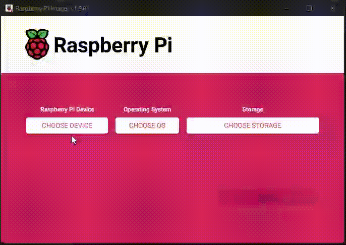

---
layout:
  title:
    visible: true
  description:
    visible: false
  tableOfContents:
    visible: true
  outline:
    visible: true
  pagination:
    visible: true
---

# 1.2 Operating system


Status: Not tested on RaMiX


We configure the Raspberry Pi and install the official operating system.

<figure><figcaption></figcaption></figure>

## Which operating system to use?

We use **Raspberry Pi OS Bookworm Lite (Debian 12 based)**, without a graphical user interface. This provides the best stability for the system and makes the initial setup a breeze.

Raspberry Pi OS is based on the [Debian](https://www.debian.org/) Linux distribution, available for most hardware platforms. To make this guide as universal as possible, it uses only standard Debian-based commands.

## Raspberry Pi Imager and Raspberry Pi OS

### Get Raspberry Pi Imager

We will use the [Raspberry Pi Imager](https://github.com/raspberrypi/rpi-imager) application **v1.8+**. Download [from here](https://www.raspberrypi.com/software/) the proper version depending on the OS platform are you using on your regular computer. If you use a Linux Debian-based distro, you can enter only the next command on the terminal: `sudo apt install rpi-imager`

### Get Raspberry Pi OS 

* Start the **Raspberry Pi Imager**
* On the “**Raspberry Pi device**” section > Push on “**Choose device**” > Select **“No filtering”**
* On the “**Operating system**” section > Push on “**Choose OS**” > “**Raspberry Pi OS (other)**” > Scroll to select **“Raspberry Pi OS Lite (64 bit)” -** _A port of Debian Bookworm with no desktop environment (Compatible with Raspberry Pi 3/4/400/5)_ and have the relevant image flashed to your drive
* Connect the external drive to your regular computer. On the “**Storage**” section > Push on “**Choose storage**” > Select your external drive
* Click on the **“NEXT”** button
* On the “Use OS customisation” banner > Click on the **“EDIT SETTINGS”** button

### &#x20;Configure boot options 

You can now pre-configure the operating system even before it’s started for the first time.

Configure the advanced options as follows.

On the **“General”** tab:

*   **Set hostname**: choose and enter a local network name for your node, for example, `ramix`.

    Note: if you want to change this later, you can adjust the hostname later by replacing it in the file `/etc/hostname` and adding it at the end of the first line in `/etc/hosts`
*   **Set username and password**: activate the checkbox and enter `admin` together with your `password [A]`

    This will create the user `admin` which we will use primarily in this guide to make it more universal.
*   **Configure WiFi**: if you will run the RaMiX connected to your wireless network, enter the WiFi name (“SSID”) and password. Also, change “Wifi country” to the two-letter [ISO2 code](https://www.iso.org/obp/ui/#search) of your country (e.g. `es`)

    If you’ll connect your RaMiX with a network cable, simply skip this setting
* **Set locale settings**: activate the checkbox, select your timezone and keyboard layout ("es" recommended for Spanish speakers)

On the **“Services”** tab:

* Activate the checkbox "**Enable SSH"  and 2 options**:&#x20;
  * Select **“Use password authentication”** to use the previously configurated "**username and password**"&#x20;
  * Select "**Allow public-key authentication only"** and enter your SSH pub key. Get your SSH key pair and more info in the "[Login with SSH keys](../bonus/system/ssh-keys.md)" bonus guide

This will allow you to connect to the Raspberry Pi remotely using “**S**ecure **SH**ell” without ever connecting it to a keyboard or screen


**(Optional)** If you want to improve your privacy, you can **uncheck** **“Enable telemetry”** on the **“Options”** tab; or ignore it


* Click on **“SAVE”**

### &#x20;Write the operating system to the external drive 

* The **“Use OS customisation”** banner shows you again > Click this time on the **“YES”** button
* Read the warning banner carefully and make sure you selected the right drive, then click **“YES” again**


The Raspberry Pi Imager now writes and verifies the operating system on your drive. It should display a “**Success**” message after


## Start your Raspberry Pi 

* Safely eject the external drive from your computer
* Connect it to your Raspberry Pi
* If you did not configure the Wifi settings: connect the Raspberry Pi to your network with an ethernet cable
* Start the Raspberry Pi by connecting it to the power adapter or pushing the ON/OFF button (only on Raspberry Pi 5)

### Does it boot? 

The 🔴 **red LED** on the Raspberry Pi will indicate that the device is powered on.

The 🟢 **green LED** should constantly be flickering after a few seconds, indicating activity. If the green LED is lit constantly, without flickering, your Raspberry Pi is probably not yet configured to boot from USB.

To enable booting from USB, follow these steps:

1. Get your hands on a microSD card (all data will be deleted, but you only need it once)
2. Using the [Raspberry Pi Imager](https://www.raspberrypi.com/software/), write config bootloader to enable “**USB Boot | NVMe Boot**” to the microSD card
3. With **“No filtering”** selected on the “Raspberry Pi device” section, on the “Operating system” section > Push on “Choose OS” > “Misc utility images > Select Bootloader (Pi 4 or Pi 5) family, depending on your Raspberry Pi version > **USB Boot | NVMe/USB Boot**
4. Connect the microSD to your regular computer. On the “Storage” section > Push on “Choose storage” > Select your microSD
5. Click on the **“NEXT”** button
6. Read the warning banner carefully and make sure you selected the right drive, then click **“YES”**.


The Raspberry Pi Imager now writes on your microSD and verifies it. It should display a “**Success**” message after


<figure><figcaption></figcaption></figure>

1. Boot your Raspberry Pi with this microSD card
2. Once the 🟢 **green LED** blinks constantly, you can disconnect the power
3. Remove the microSD card and start your Raspberry Pi again with the USB SSD/NVMe connected


Your Raspberry Pi should now boot from the SSD attached via USB/PCIe


## Fallback: if you can’t boot from your external drive 

We assume that you can boot directly from the external drive. This method works for most modern drives, but if it doesn’t work in your case, please follow the fallback instructions [Boot from microSD card instead of external drive](../bonus-guides/system/boot-from-microsd-instead-of-external-drive.md).
