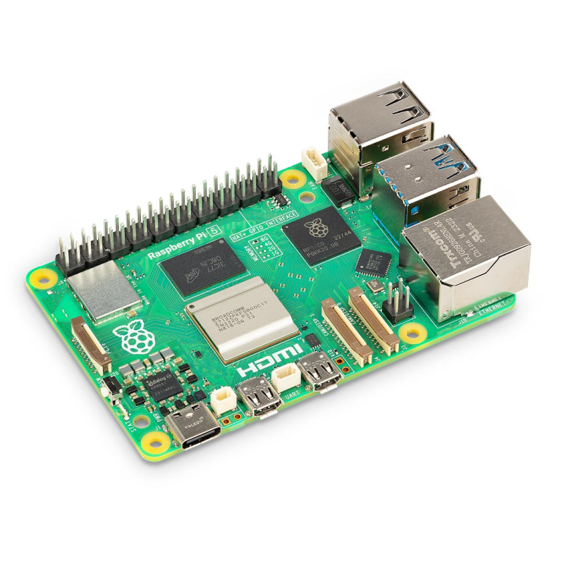

---
layout:
  title:
    visible: true
  description:
    visible: false
  tableOfContents:
    visible: true
  outline:
    visible: true
  pagination:
    visible: true
---

# 1.1 Preparations

Let's get all the necessary hardware parts and prepare some passwords.

<figure><figcaption></figcaption></figure>

## Raspberry Pi

This guide builds on the readily available Raspberry Pi.

While a personal computer is the best choice, this guide works with other computing platforms, cloud servers, or virtual machines.

<div><figure><figcaption><p>Raspberry Pi 5</p></figcaption></figure> <figure><figcaption><p>Raspberry Pi M.2 HAT+ (optional)</p></figcaption></figure></div>

## Hardware requirements

You need the following hardware:

* Raspberry Pi 4B/5  - with 4GB/8GB RAM
* Official Raspberry Pi power adapter: other adapters are a common cause of reliability issues
* Passive/active cooling
* Storage:
  * Option 1: External storage:
    * SSD enclosure with USB 3.0+
    * SSD SATA (2+ TB is recommended)
  * Option 2 (only Raspberry Pi 5): Internal storage (**recommended**):
    * Raspberry Pi PCIe to M.2 shield
      * Option 2.1: [Original Raspberry Pi M.2 HAT+](https://www.raspberrypi.com/products/m2-hat-plus/) (2230/2242 form factor)
      * Option 2.2: [Compatible shield](https://geekworm.com/products/x1002) (2230/2242/2260/2280 form factor)&#x20;
    * NVMe SSD (2+ TB is recommended) (2230/2242/2260/2280 form factor depending on your previous option selection)
* A regular computer (laptop, PC, etc)

-> You might also want to get this optional hardware:

* UPS (uninterruptible power supply)
  * Suggestions:
    * For router + node (same room): [Salicru SPS 500 ONE](https://www.salicru.com/gb-en/sps-one-1.html) \~ 50-60€
    * Only for the router (separate rooms): [SPS NET2](https://www.salicru.com/gb-en/sps-net2-1.html) \~ 50€
* Raspberry Pi case to protect it
* A temporary small microSD card to [modify the bootloader](operating-system.md#does-it-boot) or a final thumb drive to [create regular local backups of your Lightning channels](../lightning/channel-backup.md)

## Write down your passwords

You will need several passwords, and it's easiest to write them all down in the beginning, instead of bumping into them throughout the guide. They should be unique and secure, at least 12 characters. Do **not use uncommon special characters**, spaces, or quotes (‘ or “).

```
[ A ] Master admin user password
[ B ] Bitcoin RPC password
[ C ] LND wallet password
[ D ] BTC-RPC-Explorer password (optional)
[ E ] ThunderHub password
[ F ] i2pd webconsole password (optional)
```


If you need inspiration for creating your passwords: the [xkcd: Password Strength](https://xkcd.com/936/) comic is funny and contains a lot of truth. Store a copy of your passwords somewhere safe (preferably in an open-source password manager like [KeePassXC](https://keepassxc.org/)), or whatever password manager you're already using, and keep your original notes out of sight once your system is up and running.

## Secure your home network and devices

While the guide will show you how to secure your node, you will interact with it from your computer and mobile phone and use your home internet network. Before building your MiniBolt, it is recommended to secure your home network and devices. Follow Parts 1 and 2 of this ["How to Secure Your Home Network Against Threats"](https://restoreprivacy.com/secure-home-network/) tutorial by Heinrich Long, and try to implement as many points as possible (some might not apply to your router/device).
